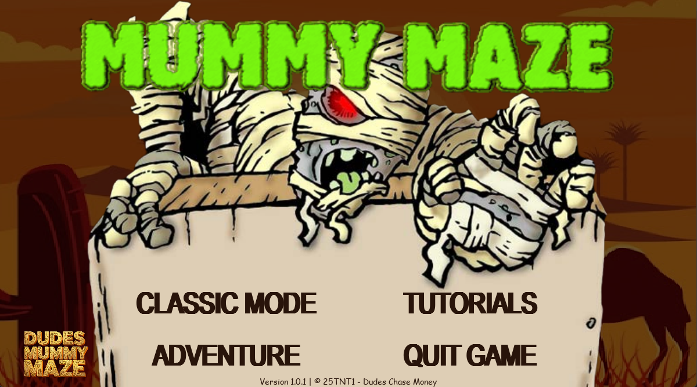

# 🏺 Mummy Maze - The Escape



---

## 📖 Giới thiệu (Introduction)

**Mummy Maze** là một trò chơi giải đố logic theo lượt (*turn-based puzzle game*), được lấy cảm hứng từ tựa game kinh điển của **PopCap**. Trong game, người chơi vào vai một nhà thám hiểm đang cố gắng thoát khỏi kim tự tháp bị nguyền rủa. Nhiệm vụ của bạn là vượt qua các mê cung phức tạp mà không để **Xác ướp (Mummy)** bắt được.

--- 

## ⚙️ Hướng dẫn cài đặt (Installation)

### 1. Yêu cầu hệ thống (Prerequisites)

- Hệ điều hành: Windows 10/11, macOS hoặc Linux
- Cài đặt sẵn **Python 3.x** *(hoặc môi trường tương ứng)*

### 2. Các bước cài đặt

**Bước 1: Clone project**

```bash
git clone https://github.com/nguyennhuthuat/-TTNT25-1-_Mummy_Maze_Project.git
cd -TTNT25-1-_Mummy_Maze_Project
```

**Bước 2: Cài đặt thư viện** 

```bash
pip install -r requirements.txt
```

**Bước 3: Chạy game**

```bash
python index.py
```

---

## 🎮 Hướng dẫn chơi (How to Play)

### 🎯 Mục tiêu

Di chuyển nhà thám hiểm đến ô **Cầu thang (Exit)** để qua màn. Đừng để xác ướp chạm vào bạn!

### 🧟 Quy luật di chuyển của Xác ướp

- Với mỗi bước của người chơi → xác ướp đi **2 bước**
- Ưu tiên di chuyển theo **chiều ngang (Horizontal)** trước
- Sau đó di chuyển theo **chiều dọc (Vertical)**
- Có thể lợi dụng tường để dụ xác ướp bị kẹt

### ⌨️ Phím điều khiển (Controls)

| Phím | Hành động |
|-----|----------|
| ↑ / W | Di chuyển lên |
| ↓ / S | Di chuyển xuống |
| ← / A | Di chuyển trái |
| → / D | Di chuyển phải |
| R | Restart màn chơi |
| Backspace | Undo |
| ESC / Q | Mở menu tạm dừng |

---

## 📸 Hình ảnh minh họa 

- Màn hình Gameplay
- Level nâng cao

---

## 🤝 Tác giả (Authors)

**Đồ án môn học**: *Cơ Sở Lập Trình*  \
**Giảng viên hướng dẫn**:
- **Lê Thanh Tùng**
- **Trần Hoàng Quân**

**Nhóm thực hiện**:

- **Nguyễn Như Thuật** 
- **Hồ Trần Quốc Thắng** 
- **Ngô Hoàng Bảo Thạch**
- **Nguyễn Hoàng Nam**
---

✨ *Cảm ơn bạn đã trải nghiệm game **Mummy Maze** của chúng tôi, mọi thắc mắc xin liên hệ: *thang2k71711tj@gmail.com*