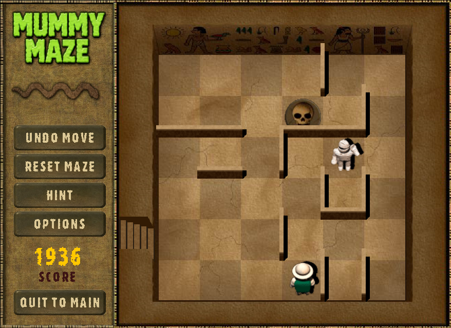

<!--
Source Code/GitHub Repository: https://github.com/nguyennhuthuat/-TTNT25-1-_Mummy_Maze_Project
-->

# 🏺 Mummy Maze - The Escape


---

## 📖 Giới thiệu (Introduction)

**Mummy Maze** là một trò chơi giải đố logic theo lượt (*turn-based puzzle game*), được lấy cảm hứng từ tựa game kinh điển của **PopCap**. Trong game, người chơi vào vai một nhà thám hiểm đang cố gắng thoát khỏi kim tự tháp bị nguyền rủa. Nhiệm vụ của bạn là vượt qua các mê cung phức tạp mà không để **Xác ướp (Mummy)** bắt được.

--- 

## ⚙️ Hướng dẫn cài đặt (Installation)

### 1️. Cài đặt Git

Git dùng để tải (clone) mã nguồn game từ GitHub.

#### 🔹 Windows

1. Truy cập: https://git-scm.com/
2. Tải **Git for Windows**
3. Cài đặt → giữ nguyên các tuỳ chọn mặc định → *Next* cho đến khi hoàn tất
4. Mở **Command Prompt** hoặc **Git Bash**, gõ:

```bash
git --version
```

Nếu thấy phiên bản Git → cài đặt thành công ✅

#### 🔹 macOS

```bash
brew install git
```

Hoặc cài trực tiếp từ trang Git chính thức.

#### 🔹 Linux (Ubuntu/Debian)

```bash
sudo apt update
sudo apt install git
```

---

### 2️. Cài đặt Python

Python là ngôn ngữ dùng để chạy game.

#### 🔹 Windows

1. Truy cập: https://www.python.org/downloads/
2. Tải **Python 3.x** (khuyên dùng bản mới nhất)
3. ⚠️ **BẮT BUỘC tick** vào ô: `Add Python to PATH`
4. Cài đặt → Finish
5. Kiểm tra:

```bash
python --version
```

#### 🔹 macOS

```bash
brew install python
```

#### 🔹 Linux
```bash
sudo apt install python3 python3-pip
```

---

### 3️. Tải mã nguồn game

Mở Terminal / Command Prompt tại thư mục bạn muốn lưu project, chạy:

```bash
git clone https://github.com/nguyennhuthuat/-TTNT25-1-_Mummy_Maze_Project.git
cd -TTNT25-1-_Mummy_Maze_Project
```

---

### 4️. (Tuỳ chọn) Tạo môi trường ảo Python

```bash
python -m venv venv
```

Kích hoạt môi trường ảo:

- **Windows**:
```bash
venv\Scripts\activate
```

- **macOS / Linux**:
```bash
source venv/bin/activate
```

---


### 5️. Cài đặt thư viện cần thiết

Nếu có file `requirements.txt`:

```bash
pip install -r requirements.txt
```

Hoặc cài thủ công với các thư viện trong file requirements.txt (ví dụ với Pygame):

```bash
pip install pygame
```

---


### 6️. Chạy game

```bash
python index.py
```

---

## 🎮 Hướng dẫn chơi (How to Play)

### 🎯 Mục tiêu

Di chuyển nhà thám hiểm đến ô **Cầu thang (Exit)** để qua màn. Đừng để xác ướp chạm vào bạn!

### 🧟 Quy luật di chuyển của Xác ướp

Mỗi xác ướp có một **Type** quyết định hành vi di chuyển.  
Với mỗi lượt của người chơi, xác ướp sẽ thực hiện **2 bước di chuyển** theo quy tắc tương ứng.

| Type | Tên | Hành vi |
|----|-----|--------|
| 0 | Zombie Trắng (Dọc) | Ưu tiên di chuyển dọc (UP/DOWN). Nếu bị chặn theo chiều dọc → đứng yên |
| 1 | Zombie Đỏ (Ngang) | Ưu tiên di chuyển ngang (LEFT/RIGHT). Nếu bị chặn theo chiều ngang → đứng yên |
| 2 | Zombie Trắng (Dọc, Thông minh) | Ưu tiên dọc. Nếu bị chặn dọc → thử di chuyển ngang |
| 3 | Zombie Đỏ (Ngang, Thông minh) | Ưu tiên ngang. Nếu bị chặn ngang → thử di chuyển dọc |

Xác ướp luôn cố gắng tiến gần nhà thám hiểm nhất theo quy tắc ưu tiên của từng loại.

### ⌨️ Phím điều khiển (Controls)

| Phím | Hành động |
|-----|----------|
| ↑ / W | Di chuyển lên |
| ↓ / S | Di chuyển xuống |
| ← / A | Di chuyển trái |
| → / D | Di chuyển phải |
| R | Restart màn chơi |
| Backspace | Undo |
| ESC / Q | Mở menu tạm dừng |

---

## 📸 Hình ảnh minh họa 

- Màn hình Gameplay




---

## 🤝 Tác giả (Authors)

**Đồ án môn học**: *Cơ Sở Lập Trình*  \
**Giảng viên hướng dẫn**:
- **Lê Thanh Tùng**
- **Trần Hoàng Quân**

**Nhóm thực hiện**:

- **Nguyễn Như Thuật** 
- **Hồ Trần Quốc Thắng** 
- **Ngô Hoàng Bảo Thạch**
- **Nguyễn Hoàng Nam**
---

✨ *Cảm ơn bạn đã trải nghiệm game **Mummy Maze** của chúng tôi, mọi thắc mắc xin liên hệ: *thang2k71711tj@gmail.com*